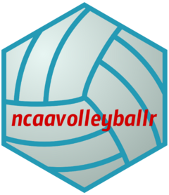

<!-- README.md is generated from README.Rmd. Please edit that file -->

```{r, include = FALSE}
#| label: setup
knitr::opts_chunk$set(
  collapse = TRUE,
  comment = "#>",
  fig.path = "man/figures/README-",
  out.width = "100%"
)
library(ncaavolleyballr)
```

# ncaavolleyballr <a href="https://jeffreyrstevens.github.io/ncaavolleyballr/"></a>


<!-- badges: start -->
[](https://www.repostatus.org/#active)
[](https://lifecycle.r-lib.org/articles/stages.html#stable) 
[](https://CRAN.R-project.org/package=ncaavolleyballr)
[](https://CRAN.R-project.org/package=ncaavolleyballr)
[](https://app.codecov.io/gh/JeffreyRStevens/ncaavolleyballr)
<!-- badges: end -->

Inspired by the NCAA data extraction functions from the [`{baseballr}`](https://billpetti.github.io/baseballr/) package, the goal of [`{ncaavolleyballr}`](https://jeffreyrstevens.github.io/ncaavolleyballr/) is to extract women\'s and men\'s volleyball information from the NCAA website. The functions in this package can extract team records/schedules and player statistics for the 2020-`r ncaavolleyballr:::most_recent_season()` NCAA women\'s and men\'s divisions I, II, and III volleyball teams. Functions can aggregate statistics for teams, conferences, divisions, or custom groups of teams.

## Installation

You can install the stable released version of flashr from [CRAN](https://cran.r-project.org/package=ncaavolleyballr) with:

```{r eval = FALSE}
install.packages("ncaavolleyballr")
```
You can install developmental versions from [GitHub](https://github.com/) with:

```{r eval = FALSE}
#| label: installpackage
# install.packages("remotes")
remotes::install_github("JeffreyRStevens/ncaavolleyballr")
```

## Usage

```{r eval=FALSE}
#| label: loadpackage
library(ncaavolleyballr)
```

A suite of functions can be used to extract season, match, and play-by-play data for teams and players. See the [Getting Started vignette](https://jeffreyrstevens.github.io/ncaavolleyballr/articles/ncaavolleyballr.html) for a more thorough description of the functions.


### Season data

The NCAA uses a unique team ID for each women\'s and men\'s volleyball team and season. So to access a team\'s season data, first you will need to get that ID with the `find_team_id()`. For instance, to find the ID for Penn State\'s 2024 season:

```{r}
#| label: findteamid
find_team_id("Penn St.", 2024)
```

With this team ID, you can now extract overall season performance data for the team\'s players with the `player_season_stats()`. 

```{r eval=FALSE}
#| label: playerseasonstats
find_team_id("Penn St.", 2024) |> 
  player_season_stats()
```

```{r echo=FALSE}
#| label: playerseasonstatsecho
find_team_id("Penn St.", 2024) |> 
  player_season_stats() |> 
  dplyr::mutate(`High School` = gsub("\u00A0", "", `High School`),
                `High School` = gsub("'", "\\\\'", `High School`))
```


### Match data

The NCAA also uses a unique contest ID for each women\'s and men\'s volleyball match. The easiest way to get that ID is with `find_team_contest()`, which returns the contest ID for all matches in a particular season (using the Team ID provided by `find_team_id()`). For instance, to find the contest ID for 2024 National Championship match between Louisville and Penn State:

```{r}
#| label: findteamcontests
find_team_id("Penn St.", 2024) |> 
  find_team_contests() |> 
  tail()
```

```{r echo=FALSE}
#| label: findcontestspennst
psu2024 <- find_team_contests(find_team_id("Penn St.", 2024))
```


From that, we can see that the contest ID is `r psu2024[psu2024$opponent == "Louisville", ]$contest[2]`. If we pass this contest ID to the `player_match_stats()` function, we\'ll get a list with two data frames (one for each team in the contest) that contain player statistics for the match. If we want to get just the Penn State player data, we can set `team = "Penn St."`.

```{r}
#| label: playermatchstats
player_match_stats(contest = "6080706", team = "Penn St.")
```

### Play-by-play data

Play-by-play data are also available with `match_pbp()`. This returns a data frame with all events and players.

```{r}
#| label: matchpbp
match_pbp(contest = "6080706") |> 
  head(10)
```

### Other functionality

By default, these functions return information on women\'s teams, but they can be set to return men\'s information by setting `sport = "MVB"`. You can also aggregate data across conferences, divisions, or custom groups with `conference_stats()`, `division_stats()`, and `group_stats()`.

## Scraped data

Scraping large amounts of data from the NCAA stats site can take a long time and is prone to unstable connections. Accessing the website too frequently or with multiple functions simultaneously can result in your IP address being blocked. To get around this issue, I have scraped all data from 2020-2024 and have posted it on the [data page](https://jeffreyrstevens.github.io/ncaavolleyballr/articles/data.html).


## Citation

To cite [`{ncaavolleyballr}`](https://jeffreyrstevens.github.io/ncaavolleyballr/), use:

```{r echo=FALSE, results='asis'}
print(readCitationFile("inst/CITATION"), style = "text")
```


## Acknowledgments

Many thanks to [Bill Petti](https://github.com/BillPetti) for making the code for NCAA stats extraction freely available in the [`{baseballr}`](https://billpetti.github.io/baseballr/) package. And thank you to [Tyler Widdison](https://github.com/widbuntu) for [inspiring me to extract the play-by-play data](https://github.com/JeffreyRStevens/ncaavolleyballr/issues/1) (check out his [`{ncaavolleyballR}`](https://github.com/tyler-widdison/ncaavolleyballR) package for some similar functionality). Code from [`{baseballr}`](https://billpetti.github.io/baseballr/) and [`{rvest}`](https://rvest.tidyverse.org/)
(both licensed under an MIT license) have been incorporated and modified in this package.

The volleyball background in the logo was designed by [Freepik](https://www.freepik.com/free-vector/volleyball-grey-gradient_59539214.htm).
